# Kuma's LLM Toolkit 2025
A Python utility package for working with LLMs.
```
　 　 　┼╂┼
　 　 ∩＿┃＿∩
    |ノ      ヽ
   /   ●    ● |
  |     (_●_) ミ        < There is absolutely no warranty. >
 彡､     |∪|  ､｀＼ 
/ ＿＿   ヽノ /´>  )
(＿＿＿）    / (_／
```

# Installation
Install latest version using pip:
```bash
pip install git+https://github.com/analokmaus/kuma_llm_utils.git@main
```

Install full latest version using pip:
```bash
pip install git+https://github.com/analokmaus/kuma_llm_utils.git@main
pip install kuma_llm_utils[all]
```

# Usage
- [Text-to-text generation using commercial APIs](examples/01_text_inference.ipynb)
- [Multimodal generation using commercial APIs](examples/02_multimodal_inference.ipynb)
- [Few-shot multimodal generation](examples/03_fewshot_inference.ipynb)
- [Generation using local huggingface models](examples/04_inference_with_hf_models_using_vllm.ipynb)
- [Simple router pipeline](examples/05_routing.ipynb)

# UML diagram (auto-generated)

```mermaid
classDiagram
    class AbstractPipeline {
        +logger
        +name
        +generate(inputs: dict) -> dict
        +check_format(inputs: dict, outputs: dict)
    }

    class LLMModule {
        +llm: AbstractLLMWorker
        +mode: str
        +output_key: str
        +input_keys: list
        +output_keys: list
        +generate(inputs: dict) -> dict
    }

    class JsonToText {
        +json_key: str
        +template: str
        +output_key: str
        +verbose: bool
        +input_keys: list
        +output_keys: list
        -_apply_template(json_dict: dict)
        +generate(inputs: dict) -> dict
    }

    class UpdateKey {
        +update_dict: dict
        +input_keys: list
        +output_keys: list
        +generate(inputs: dict) -> dict
    }

    class Compose {
        +pipelines: list[AbstractPipeline]
        +input_keys: list
        +output_keys: list
        +generate(inputs: dict) -> dict
    }

    class LLMRouter {
        +route_llm: AbstractLLMWorker
        +job_pipeline: dict[str, AbstractPipeline]
        +input_keys: list
        +output_keys: list
        -_postprocess_route(route: str)
        +generate(inputs: dict) -> dict
    }

    class KeyRouter {
        +target_key: str
        +job_pipeline: dict[str, AbstractPipeline]
        +input_keys: list
        +output_keys: list
        +generate(inputs: dict) -> dict
    }

    AbstractPipeline <|-- LLMModule
    AbstractPipeline <|-- JsonToText
    AbstractPipeline <|-- UpdateKey
    AbstractPipeline <|-- Compose
    AbstractPipeline <|-- LLMRouter
    AbstractPipeline <|-- KeyRouter

    Compose o-- "*" AbstractPipeline : contains
    LLMRouter o-- "*" AbstractPipeline : routes to
    KeyRouter o-- "*" AbstractPipeline : routes to
    class AbstractLLMEngine {
        +logger
        +name
        +generate()
        +generate_batched()
        +get_tokenizer()
    }

    class AbstractLLMWorker {
        +logger
        +name
        +_check_template()
        +generate()
        +generate_batched()
        +generate_parallel()
        +generate_batched_streaming()
        +generate_parallel_streaming()
    }

    class OpenAIClient {
        +api_key
        +client
        +usage_limits
        -_retrieve_api_key()
        -_call_time_manager()
        -_update_counter()
        -_async_generate()
    }

    class OpenAIWorker {
        +engine
        +template
        +prompt_default_fields
        +prompt_required_fields
        +system_prompt
        +generation_params
        -_fill_template()
        -_get_prompt()
        -_parse_inputs()
    }

    class OpenAIVisionWorker {
        +image_max_size
        -_process_image()
        -_get_prompt()
    }

    class AnthropicClient {
        +api_key
        +client
        +usage_limits
        -_retrieve_api_key()
        -_call_time_manager()
        -_update_counter()
        -_async_generate()
    }

    class AnthropicWorker {
        +engine
        +template
        +prompt_default_fields
        +prompt_required_fields
        +system_prompt
        +generation_params
        -_fill_template()
        -_get_prompt()
        -_parse_inputs()
    }

    class AnthropicVisionWorker {
        +image_max_size
        -_process_image()
        -_get_prompt()
    }

    class GoogleAIClient {
        +api_key
        +client
        +usage_limits
        -_retrieve_api_key()
        -_call_time_manager()
        -_update_counter()
        -_async_generate()
    }

    class GoogleAIWorker {
        +engine
        +template
        +prompt_default_fields
        +prompt_required_fields
        +system_prompt
        +generation_params
        -_fill_template()
        -_get_prompt()
        -_parse_inputs()
    }

    class GoogleAIVisionWorker {
        +image_max_size
        -_process_image()
        -_get_prompt()
    }

    class vLLMEngineAsync {
        +engine
        +_model_name
        -_async_generate()
        +get_tokenizer()
        +get_preprocessor()
    }

    class vLLMWorkerAsync {
        +engine
        +template
        +prompt_default_fields
        +prompt_required_fields
        +system_prompt
        +generation_params
        +remove_reasoning_tag
        -_fill_template()
        -_get_prompt()
        -_parse_inputs()
    }

    class vLLMVisionWorkerAsync {
        +image_max_size
        +preprocessor
        -_process_image()
        -_get_prompt()
        -_parse_inputs()
    }

    class LimitManager {
        +limits
        +logger
        +state
        +add()
        +check()
    }

    AbstractLLMEngine <|-- OpenAIClient
    AbstractLLMEngine <|-- AnthropicClient
    AbstractLLMEngine <|-- GoogleAIClient
    AbstractLLMEngine <|-- vLLMEngineAsync

    AbstractLLMWorker <|-- OpenAIWorker
    AbstractLLMWorker <|-- AnthropicWorker
    AbstractLLMWorker <|-- GoogleAIWorker
    AbstractLLMWorker <|-- vLLMWorkerAsync

    OpenAIWorker <|-- OpenAIVisionWorker
    AnthropicWorker <|-- AnthropicVisionWorker
    GoogleAIWorker <|-- GoogleAIVisionWorker
    vLLMWorkerAsync <|-- vLLMVisionWorkerAsync

    OpenAIClient -- LimitManager
    AnthropicClient -- LimitManager
    GoogleAIClient -- LimitManager

    OpenAIWorker -- OpenAIClient
    AnthropicWorker -- AnthropicClient
    GoogleAIWorker -- GoogleAIClient
    vLLMWorkerAsync -- vLLMEngineAsync
```
